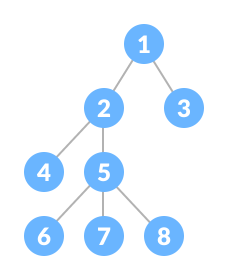

# TREES DATA STRUCTURE

Trees represent nodes connected by edges eg. binary trees, AVL trees etc.
Example:
image:

**important terms**

+ Path

+ Root

+ Parent

+ Edges

+ Nodes

+ Subtree

+ Branches

+ Levels

## Binary trees

This is a tree data structure which each node a maximum of two children (left child and right child).

Example: image:

## Types of binary trees.

### _complete binary tree_
Every level except possibly the last is completely filled and all nodes in the last level are as far left as possible.

### _full/proper/plane binary tree_
Its a tree in which every node have either 0 or 2 children.

# Basic Operations.
* insert

* search

* traversal

# __TREE TRAVERSAL__

This is the process of visiting all nodes in a tree and print all the values starting from the root.

## Methods of tree traversal

### 1. in order traversal.

The left child/subtree is visited first, then the root/parent and later the right child/subtree (L rt R).

### 2. pre order traversal.
The root/parent node is visited first then the left child/subtree and finally the right child/subtree (rt L R).

### 3. post order traversal.
The left child/subtree is visited first followed by the right child/subtree and lastly the root/parent(L R rt).

# links
[Trees in Data Structure](https://www.youtube.com/watch?v=1-l_UOFi1Xw&t=5s)

